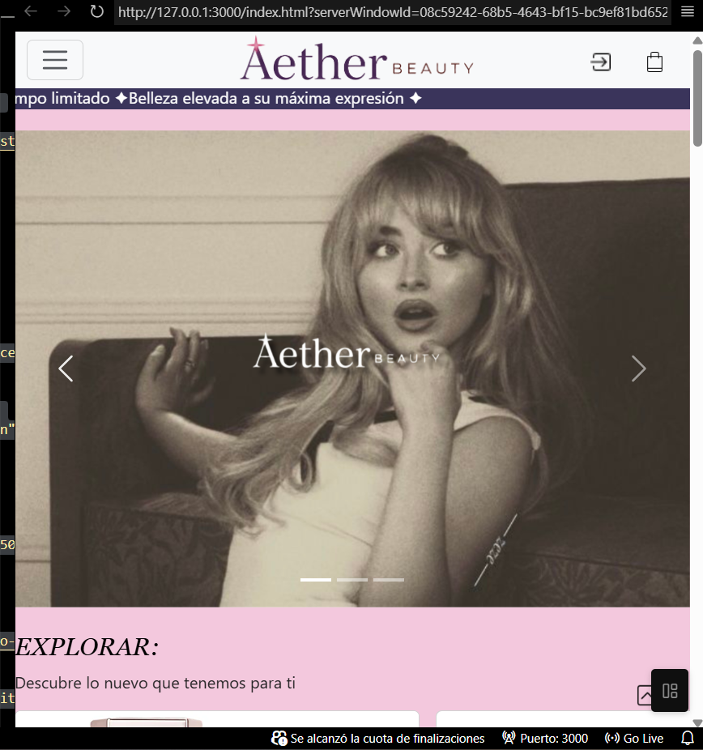
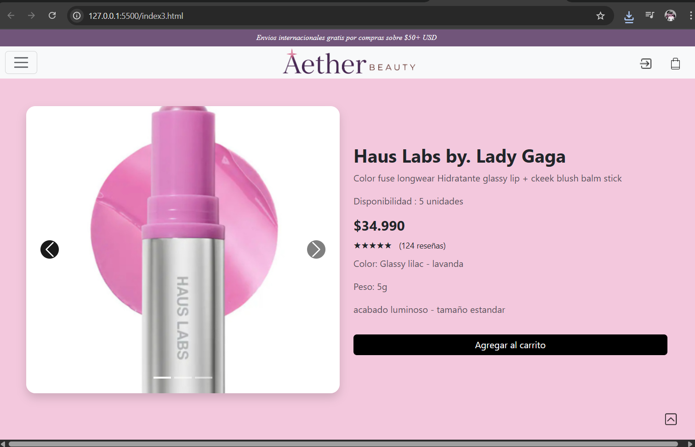

# M2 — E-commerce Frontend
# Aether Beauty 

## Descripción
interfast de webm estilo e-commerce, que contiene el home, un navbar, listado de productos, y especificación del mismo.
la pagina principal, viene enlasada con la pagina 2 y la 2 con la pag 3.
el logo de la marca, lleva de vuelta a la pag 1.
todos los profuctos del listado llevan directamente a la descripcion/ pagina de un solo producto, 

## Tecnologías
- HTML5, CSS3, JavaScript (vanilla)
- Bootstrap por CDN

## Ejecutar el proyecto
- Opción 1: abrir `index.html` en el navegador.
- Opción 2 : usar una extensión de servidor local (Live Server en VS Code).
- Opción 3 : revisar index, index 2 e index3, asi mismo los 3 cuentan con sus respectivos css y js 

## Funcionalidades
- Navbar para navegar por la página
- Listado de productos en tarjetas con botón de compra
- Página de detalle de producto
- Footer con información de la tienda
- Uso de cards, carousel, botón de desplazamiento, menús desplegables, entre otros elementos
## Capturas

#Autor: 

Cata
## Autor
catalinacid37-lgtm - https://github.com/catalinacid37-lgtm

